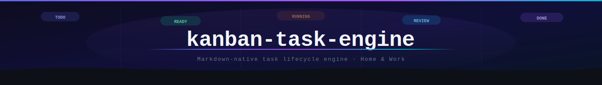
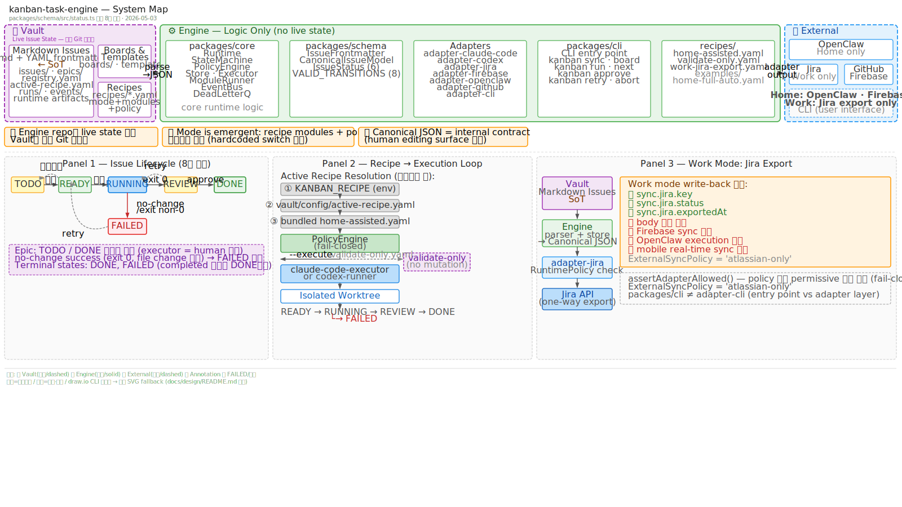

<!-- ──────────────── HERO ──────────────── -->
<div align="center">



<br/>


<br/><br/>

<h3>
  <code>.md</code> 파일을 source of truth로 두고<br/>
  <b>Home · Work 환경의 task lifecycle을 하나의 schema로 다루는 TypeScript workspace</b>입니다.
</h3>

<p>
  Engine repo에는 live issue state가 없습니다.<br/>
  실제 상태는 <b>별도 Vault 저장소</b>에 살아있으며, engine은 로직·schema·policy·adapter contract만 담당합니다.
</p>

<br/>

<p>
  <a href="#-아키텍처-개요"></a>
  <a href="#-home-and-work-modes"></a>
  <a href="#-cli"></a>
  <a href="#-key-concepts"></a>
  <a href="#-documentation"></a>
</p>

</div>

<br/>


<br/>

## 🏛️ 아키텍처 개요

<p align="center">
  <a href="docs/design/kanban-task-engine-one-page.svg">
    
  </a>
</p>

> 💡 이미지를 클릭하면 full-size 다이어그램을 볼 수 있습니다. 로컬 인터랙티브 버전은 [`docs/design/kanban-task-engine-one-page.html`](docs/design/kanban-task-engine-one-page.html)을 브라우저로 열어주세요.

<details>
<summary><b>Architecture Detail (Text Version)</b></summary>

<br/>

- **Vault** (별도 Git 저장소): Markdown Issues (`.md` + YAML frontmatter), Boards & Templates, Recipes (`.yaml`)
- **Engine** (이 저장소): `packages/core` (Runtime, State Machine, Policy, Store, Executor), `packages/schema` (Frontmatter schema, Canonical JSON model), Adapters (openclaw, claude-code, codex, jira, cli, github, firebase)
- **External Systems**: OpenClaw, Jira, GitHub, Firebase, CLI
- **Data Flow**: Vault Markdown → Engine parser/store → Canonical JSON → Adapter → External System
- **Mode**: recipe의 `modules` + `policy` 조합으로 결정되는 emergent property. 코드에 hardcoded switch 없음.
- **Canonical JSON**: 내부 contract. 사람이 직접 편집하는 surface 아님.
- **Issue Status Transitions**: `TODO ⇄ READY → RUNNING → REVIEW ⇄ RUNNING`, `RUNNING → FAILED → READY`, `REVIEW → DONE`. 총 8개 전이.
- **Executors**: `claude-code-executor`, `codex-runner` — 각각 별도 isolated worktree에서 실행.

</details>

<br/>

### 🎨 핵심 설계 포인트

<table>
<tr>
<td width="50%" valign="top">

#### 🟣 Vault ↔ Engine 분리
`.md` 파일은 **사람이 읽고 쓰는 source of truth**.<br/>
Canonical JSON, board files, run artifacts는 생성 산출물로 두 번째 SoT가 되어선 안 됩니다.

</td>
<td width="50%" valign="top">

#### 🟢 Mode is Emergent
`home` / `work` / `validate-only`는 코드에 hardcoded되지 않습니다.<br/>
**recipe YAML의 `modules` + `policy` 조합**이 실행 시점에 모드를 결정합니다.

</td>
</tr>
<tr>
<td width="50%" valign="top">

#### 🔵 Adapter Policy (Fail-Closed)
`RuntimePolicy` 없이 permissive하게 동작하는 adapter는 없습니다.<br/>
**`assertAdapterAllowed()`** 가 모든 실행 전 policy를 확인하고 거부합니다.

</td>
<td width="50%" valign="top">

#### 🟠 Worktree-Based Execution
agent executor는 target repo 내부의 **isolated worktree**에서 작업합니다.<br/>
`RUNNING → REVIEW | FAILED` 수렴이 보장되어야 합니다.

</td>
</tr>
</table>

<br/>


<br/>

## 🏠 Home And Work Modes

<table>
<thead>
<tr>
<th align="center" width="33%">

</th>
<th align="center" width="33%">

</th>
<th align="center" width="33%">

</th>
</tr>
</thead>
<tbody>
<tr>
<td valign="top">

OpenClaw operator workspace와 local Markdown vault를 사용합니다.

**허용:**
- ✅ board generation
- ✅ audit log
- ✅ git checkpoint
- ✅ agent execution (`--execute`)
- ✅ OpenClaw, Firebase sync

**Recipe:** `recipes/home-assisted.yaml`

</td>
<td valign="top">

같은 schema·parser를 사용하지만 automation surface를 좁힙니다.

**허용:**
- ✅ Jira export (`sync.jira.*`)
- ✅ `sync.jira.key` / `.status` / `.exportedAt` write-back

**금지:**
- ❌ Firebase, OpenClaw execution
- ❌ mobile real-time sync
- ❌ body 수정

**Recipe:** `recipes/work-jira-export.yaml`

</td>
<td valign="top">

mutation 없이 schema·policy validation만 수행합니다.

**허용:**
- ✅ schema validation
- ✅ policy check
- ✅ lint

**금지:**
- ❌ 모든 side-effect

**Recipe:** `recipes/validate-only.yaml`

</td>
</tr>
</tbody>
</table>

**Active Recipe Resolution 순서:**

```
① KANBAN_RECIPE (env)
② <vaultRoot>/config/active-recipe.yaml
③ bundled recipes/home-assisted.yaml
```

<br/>


<br/>

## ⚡ Quick Start

```bash
pnpm install
pnpm -r build
pnpm -r test
pnpm eval:superpowers
pnpm eval:hardening
```

운영 vault를 대상으로 CLI를 실행할 때는 `KANBAN_HOME`을 Markdown vault root로 지정합니다.

```bash
KANBAN_HOME=$HOME/.openclaw/workspace-kanban/kanban \
  pnpm --filter @kanban-task-engine/cli start -- sync
```

> ⚠️ `config/workspaces.json`은 migration-only legacy config입니다. 신규 runtime은 vault의 `registry.yaml`, active recipe, `KANBAN_HOME`을 기준으로 동작합니다.

<br/>


<br/>

## ⌨️ CLI

### 주요 Commands

<table>
<thead>
<tr>
<th align="center">그룹</th>
<th>명령</th>
<th>동작</th>
</tr>
</thead>
<tbody>
<tr>
<td align="center"></td>
<td><code>kanban sync</code><br/><code>kanban board</code><br/><code>kanban next</code><br/><code>kanban run &lt;id&gt;</code></td>
<td>vault issue 읽기 · validation count 출력<br/>registry 기반 board 생성<br/>최우선 <code>READY</code> issue 조회 (read-only)<br/>inspect-only (mutation 없음)</td>
</tr>
<tr>
<td align="center"></td>
<td><code>kanban next --execute</code><br/><code>kanban run &lt;id&gt; --execute --agent codex|claude-code|mock</code></td>
<td>최우선 READY issue를 실행 lifecycle로 진입<br/>명시적 agent로 실행</td>
</tr>
<tr>
<td align="center"></td>
<td><code>kanban approve</code><br/><code>kanban abort</code><br/><code>kanban retry</code><br/><code>kanban recover-run</code></td>
<td>REVIEW → DONE<br/>실행 중단<br/>FAILED → READY 재시도<br/>stale RUNNING cleanup</td>
</tr>
</tbody>
</table>

### Issue Status Transitions

`packages/schema/src/status.ts` 기준 — 8개 전이:

<table>
<thead>
<tr>
<th>전이</th><th>방향</th><th>트리거</th>
</tr>
</thead>
<tbody>
<tr><td><code>TODO → READY</code></td><td>전진</td><td>실행 준비 완료</td></tr>
<tr><td><code>READY → TODO</code></td><td>후퇴</td><td>준비 취소 (되돌리기)</td></tr>
<tr><td><code>READY → RUNNING</code></td><td>전진</td><td><code>--execute</code></td></tr>
<tr><td><code>RUNNING → REVIEW</code></td><td>전진</td><td>agent exit 0 + file change</td></tr>
<tr><td><code>RUNNING → FAILED</code></td><td>전진</td><td>exit non-0 또는 no-change</td></tr>
<tr><td><code>REVIEW → DONE</code></td><td>전진</td><td><code>kanban approve</code></td></tr>
<tr><td><code>REVIEW → RUNNING</code></td><td>후퇴</td><td><code>kanban retry</code> (재실행)</td></tr>
<tr><td><code>FAILED → READY</code></td><td>후퇴</td><td><code>kanban retry</code></td></tr>
</tbody>
</table>

> ⚠️ `RUNNING`에 도달한 run은 반드시 `REVIEW` 또는 `FAILED`로 수렴해야 합니다.<br/>
> no-change success (exit 0 + file change 없음) → `FAILED` 기록.

<br/>


<br/>

## 💡 Key Concepts

<table>
<tr>
<td width="50%" valign="top">

#### 📄 Markdown = SoT
`.md` 파일이 Canonical JSON보다 상위의 source of truth입니다.<br/>
Canonical JSON, board files, run artifacts는 generated runtime artifacts이며 두 번째 SoT가 되어선 안 됩니다.

</td>
<td width="50%" valign="top">

#### 🏗️ Vault / Engine 분리
Engine repo에는 live issue state가 없습니다.<br/>
상태는 Vault(별도 Git 저장소)에 있습니다.<br/>
`KANBAN_HOME` 환경변수로 vault root를 지정합니다.

</td>
</tr>
<tr>
<td width="50%" valign="top">

#### ⚙️ Canonical JSON
engine과 adapter 간 데이터 교환용 **내부 contract**입니다.<br/>
`CanonicalIssueModel` 인터페이스로 정의되며 사람이 직접 편집하는 surface가 아닙니다.

</td>
<td width="50%" valign="top">

#### 🔒 Safety Model
schema validation → registry-aware traversal → safe path containment → runtime policy → adapter guard → execution preflight → git checkpoint 순서로 겹쳐집니다.<br/>
issue id의 path traversal, slash, NUL, leading dash는 거부합니다.

</td>
</tr>
</table>

<br/>


<br/>

## 📦 Project Structure

```text
packages/
├── core/                  # Runtime, State Machine, Policy, Store, Executor
├── schema/                # Frontmatter schema, Canonical JSON model
├── cli/                   # CLI entry point (kanban 명령 진입점)
├── adapter-cli/           # CLI adapter layer
├── adapter-claude-code/   # claude-code agent executor
├── adapter-firebase/      # Firebase/mobile sync (Home only)
├── adapter-github/        # GitHub integration
├── adapter-jira/          # Jira export adapter (Work mode)
└── adapter-openclaw/      # OpenClaw operator workspace (Home only)
```

<br/>


<br/>

## 🎯 사용 시나리오

<table>
<thead>
<tr>
<th align="center" width="33%">

</th>
<th align="center" width="33%">

</th>
<th align="center" width="33%">

</th>
</tr>
</thead>
<tbody>
<tr>
<td valign="top">

**🎬 상황**
로컬 vault의 READY issue를 agent가 자동 실행

**📋 단계**

```diff
+ ① vault 동기화 확인
  kanban sync

+ ② 실행 대상 확인
  kanban next

+ ③ agent 실행
  kanban run VC-001 \
    --execute \
    --agent claude-code

+ ④ 리뷰 후 승인
  kanban approve
```

**✨ 결과**
`READY → RUNNING → REVIEW → DONE`<br/>
run artifacts가 vault `runs/` 에 보존

</td>
<td valign="top">

**🎬 상황**
Work 환경에서 Markdown issue를 Jira로 export

**📋 단계**

```diff
+ ① Work recipe 활성화
  export KANBAN_RECIPE=\
  recipes/work-jira-export.yaml

+ ② vault 읽기 + validation
  kanban sync

+ ③ Jira export 실행
  kanban board

+ ④ write-back 확인
  sync.jira.key 등 메타만 갱신
```

**✨ 결과**
Markdown body 수정 없이 `sync.jira.*` 네임스페이스만 업데이트.<br/>Firebase·OpenClaw execution은 차단됨.

</td>
<td valign="top">

**🎬 상황**
CI에서 schema·policy만 검증, mutation 없음

**📋 단계**

```diff
+ ① validate-only recipe 지정
  export KANBAN_RECIPE=\
  recipes/validate-only.yaml

+ ② schema + policy 검증
  kanban sync

+ ③ hardening 체크
  pnpm eval:hardening

+ ④ CI 통과 확인
  exit code 0
```

**✨ 결과**
issue 상태 변경 없음.<br/>schema 오류·policy 위반만 리포트.

</td>
</tr>
</tbody>
</table>

<br/>


<br/>

## 🔒 Safety & CI

```bash
# 전체 빌드 + 테스트
pnpm -r build
pnpm -r test

# superpowers · hardening eval
pnpm eval:superpowers
pnpm eval:hardening

# whitespace 검사
git diff --check

# strict architecture allowlist
pnpm eval:hardening -- --strict-architecture
```

배포 전 확인은 [`docs/deploy-checklist.md`](docs/deploy-checklist.md)를 따릅니다.

<br/>


<br/>

## 📚 Documentation

<table>
<thead>
<tr>
<th>문서</th><th>언제 참고</th>
</tr>
</thead>
<tbody>
<tr>
<td>⚡ <a href="docs/superpowers/specs/2026-05-02-kanban-system-hardening-spec.md"><b>System Hardening Spec</b></a></td>
<td>no-change execution, <code>next --execute</code>, Work metadata, hardening CI 판단</td>
</tr>
<tr>
<td>📋 <a href="docs/superpowers/plans/2026-05-02-kanban-system-hardening-plan.md"><b>System Hardening Plan</b></a></td>
<td>hardening 구현 단계별 계획 확인</td>
</tr>
<tr>
<td>🏃 <a href="docs/kanban-runtime.md"><b>Runtime Guide</b></a></td>
<td>runtime topology, 환경 변수, operator commands 확인</td>
</tr>
<tr>
<td>✅ <a href="docs/deploy-checklist.md"><b>Deploy Checklist</b></a></td>
<td>배포 전 확인 항목, rollback 트리거, tech-debt triage</td>
</tr>
<tr>
<td>🎨 <a href="docs/design/"><b>Architecture Visualization</b></a></td>
<td>draw.io source, SVG asset, 색상 규칙, 수정 가이드</td>
</tr>
<tr>
<td>🗂️ <a href="docs/archive/README.md"><b>Archived Design Index</b></a></td>
<td>이전 설계 문서 참조</td>
</tr>
</tbody>
</table>

<br/>

<!-- ──────────────── FOOTER ──────────────── -->
<div align="center">


<sub>
  <a href="https://github.com/pureliture">@pureliture</a> ·
  Markdown-native · TypeScript · pnpm workspace ·
  Vault / Engine separated by design
</sub>

</div>
