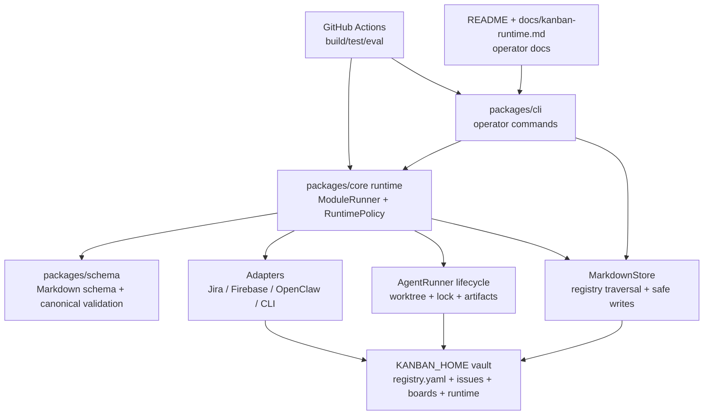

# Kanban Task Engine System Hardening Spec

날짜: 2026-05-02
상태: Proposed
저장소: `~/Projects/kanban-task-engine`
대상 branch/worktree: `codex-gpt-55-pro-review-fixes`, `/Users/ddalkak/Projects/kanban-task-engine/.worktrees/gpt-55-pro-review-fixes`

## 1. 목적

이 문서는 GPT-5.5-pro 정적 리뷰에서 지적된 architecture, schema, execution, adapter, CLI, configuration, documentation gap을 하나의 정본 runtime contract로 재정렬한다. 목표는 `kanban-task-engine`을 Markdown-first MVP에서 Home/Work 환경 모두에 투입 가능한 안전한 control-plane engine으로 끌어올리는 것이다.

이 문서는 다음 기존 문서를 supersede하지 않고, 구현 판단의 최신 정렬 계층으로 둔다.

- `docs/superpowers/specs/2026-04-23-kanban-control-plane-design.md`: control-plane 방향과 vault layout의 원 설계.
- `docs/superpowers/specs/2026-04-30-agent-runner-codex-target-design.md`: `AgentRunner`와 Codex backend의 실행 계약.
- `docs/kanban-runtime.md`: 운영자용 runtime guide로 재작성 대상.

## 2. 입력과 현재 상태

### 2.1 리뷰 입력

GPT-5.5-pro 리뷰는 GitHub API 기반 정적 분석이며, local clone 검증과 `pnpm -r test` 실행은 포함하지 않았다. 따라서 이 spec은 리뷰 지적을 그대로 수용하지 않고 현재 worktree의 실제 파일 상태와 대조한 뒤 정본 결정을 내린다.

### 2.2 현재 worktree에서 확인한 사실

- `README.md`는 제목만 있다.
- `.github/workflows`는 없다.
- `docs/kanban-runtime.md`는 runtime flow, lock, approve/abort/retry를 설명하지 않는다.
- `recipes/work-jira-export.yaml`은 없다.
- `packages/core/src/runtime/policy.ts`는 `allowedSideEffects`만 표현한다.
- `packages/core/src/store/markdown-store.ts`는 `<base>/issues/*.md` 1-depth만 탐색하고, write path를 `task.automation.workspace` 기준으로 계산한다.
- `packages/schema/src/issue-schema.ts`의 필수 Markdown section에는 `로그`가 없다.
- `packages/schema/src/status.ts`와 `packages/core/src/state-machine.ts`는 Epic type별 상태 제한을 강제하지 않는다.
- `packages/core/src/state-machine.ts`는 `FAILED` 전이에 `completed`를 기록한다.
- `packages/core/src/executor/execution-target.ts`는 `working_dir` 누락 시 실패한다.
- `packages/core/src/executor/git.ts`는 `origin/HEAD`만 default branch source로 사용하고 `fetch origin --prune`을 고정 호출한다.
- `packages/core/src/executor/run-issue.ts`는 no-change success를 `FAILED`로 수렴한다. 이 spec은 이를 최신 정본으로 채택한다.
- `packages/cli/src/commands/run.ts`는 `run` inspect-only와 `--execute` 실행 분리를 유지하며, `cliAgent` source contract가 이미 반영되어 있다.
- `packages/cli/src/commands/sync.ts`, `board.ts`, `next.ts`는 아직 validation/generation/execution trigger semantics가 부족하다.
- Firebase adapter와 OpenClaw adapter는 Work/Home policy gate와 durable retry semantics가 부족하다.

## 3. 목표

1. Markdown vault를 유일한 human-readable source of truth로 유지한다.
2. Home/Work 환경 차이를 schema fork가 아니라 policy, recipe, adapter allowlist로 강제한다.
3. Epic, READY, `로그`, automation metadata, Jira-compatible canonical JSON 계약을 schema와 runtime에서 일관되게 검증한다.
4. Registry 기반 nested vault traversal과 path containment를 구현해 issue 누락과 vault 외부 write를 막는다.
5. Agent execution lifecycle을 deterministic하게 만든다. 모든 `RUNNING`은 `REVIEW` 또는 `FAILED`로 수렴해야 하며, approve 전 자동 merge는 금지한다.
6. Work mode에서 Firebase, OpenClaw execution, mobile real-time sync가 활성화되지 않도록 central policy와 adapter-level guard를 둔다.
7. CLI를 실제 operator surface로 만든다. `sync`, `board`, `next`, `run`, `approve`, `abort`, `retry`가 문서화된 동작을 수행해야 한다.
8. README, runtime docs, archive delta index, CI workflow를 추가해 프로젝트를 외부 reviewer와 후속 agent가 재현 가능하게 만든다.

## 4. 범위 제외

- Jira를 source of truth로 승격하지 않는다.
- Work mode에서 bidirectional Jira sync를 만들지 않는다.
- Firebase, OpenClaw, mobile sync를 Work mode에 허용하지 않는다.
- `kanban run <id>` bare command를 실행 trigger로 바꾸지 않는다. 실행은 `--execute`가 명시될 때만 수행한다.
- live Codex credential이나 live Jira credential을 CI 필수 조건으로 두지 않는다.
- stale archived spec을 삭제하지 않는다. 대신 delta index로 superseding 관계를 명확히 한다.

## 5. 정본 결정

### ADR-001: no-change execution success는 `FAILED`

**Context:** 2026-04-23 control-plane 문서는 agent exit 0 + no git changes를 `REVIEW` warning으로 설명했다. 2026-04-30 AgentRunner 문서와 현재 `runIssueWithAgent()` 구현은 이를 `FAILED`로 수렴한다.

**Decision:** no-change success는 `FAILED`로 고정한다.

**Rationale:**

- `REVIEW`는 approve 가능한 checkpoint commit이 있어야 의미가 있다.
- no-change run은 approve할 branch head가 없거나 base와 동일하므로 operator action이 모호하다.
- 실패로 수렴하되 artifact, issue log, cleanup guidance에 “agent exited zero but produced no file changes”를 남기면 진단 가능성이 높다.

**Consequences:**

- `docs/superpowers/specs/2026-04-23-kanban-control-plane-design.md`에는 superseded note가 필요하다.
- `docs/kanban-runtime.md`, tests, CLI output은 no-change `FAILED` 기준으로 정렬한다.

### ADR-002: bare `next`는 discovery, `next --execute`가 execution trigger

**Context:** 리뷰는 `kanban next`가 실행 trigger가 아니라고 지적했다. 하지만 현재 AgentRunner spec은 `run <id> --execute`를 명시 실행 gate로 둔다.

**Decision:** bare `kanban next`는 가장 우선순위가 높은 `READY` issue를 출력만 한다. `kanban next --execute`는 선택된 `READY` issue를 `run <id> --execute`와 동일한 lifecycle로 실행한다.

**Rationale:**

- operator가 command typo나 curiosity로 agent execution을 시작하지 않게 한다.
- 리뷰의 “next trigger” 요구는 `next --execute`로 충족한다.
- `run <id>` inspect-only backward compatibility를 유지한다.

### ADR-003: Work mode gate는 central policy와 adapter guard 둘 다 필요

**Decision:** `RuntimePolicy`가 Work/Home mode, execution permission, external sync class, write-back allowlist를 표현한다. Firebase/OpenClaw/Jira adapter는 policy object를 받아 adapter boundary에서도 deny한다.

**Rationale:** recipe loader나 module runner 버그 하나로 금지 adapter가 실행되는 것을 막아야 한다. Work mode policy는 runtime orchestration과 adapter constructor/use path 양쪽에서 실패 닫힘이어야 한다.

### ADR-004: repo-specific process knowledge는 skill 후보로 관리하되 즉시 auto-discovered skill로 만들지 않는다

**Decision:** 이번 hardening plan에는 `skill-creator`와 `superpowers:writing-skills`를 “반복 실패 방지용 process skill 후보 평가” 단계로 포함한다. 단, project-specific convention은 우선 repo docs에 두고, 여러 repo에 재사용될 판단 규칙만 별도 skill로 승격한다.

**Rationale:** `skill-creator` 원칙상 project-specific convention은 global skill보다 repo 문서와 plan에 두는 편이 더 안전하다.

## 6. Target Architecture



### 6.1 Component responsibilities

| Component | Responsibility | Must not do |
| --- | --- | --- |
| `packages/schema` | Parse frontmatter/body, validate issue type/status/sections, validate canonical JSON | Read filesystem, know adapter credentials |
| `packages/core/store` | Traverse registry vault, map Markdown to canonical, safe writes within vault | Infer live issue layout from engine repo state |
| `packages/core/runtime` | Enforce recipe module ordering and policy side effects | Let adapter-specific code bypass policy |
| `packages/core/executor` | Lock, worktree, prompt, agent run, checkpoint, artifact, final state convergence | Directly approve/merge target branches |
| `packages/cli` | Stable operator interface and human-readable output | Reimplement core path normalization differently |
| adapters | External boundary only, guarded by policy | Own canonical state or lifecycle transitions |
| docs/CI | Make behavior reproducible and reviewable | Become a second source of truth that contradicts tests |

## 7. Schema Contract

### 7.1 Required frontmatter

All issues require:

- `id`
- `title`
- `type`
- `status`
- `executor`
- `project`
- `created`
- `updated`

`project` may be an empty string only when:

- `type: epic`, or
- registry context says the issue belongs to a `single` space.

Schema-only validation without registry context must remain conservative. Registry-aware validation is added as a separate function so existing public API behavior can be migrated deliberately.

`id` is also a filesystem path segment input because execution artifacts and worktrees include it in paths. It must be segment-safe:

- no `/`, `\`, NUL, `.`, or `..`,
- no leading `-`,
- no whitespace-only value,
- generated Home/Work ids must match the owning registry `idPrefix` pattern,
- imported legacy ids must pass an explicit compatibility allowlist before they can be used in paths.

### 7.2 Required sections

Task-like issues (`task`, `bug`, `chore`, `docs`) require non-empty:

- `목적`
- `컨텍스트`
- `Acceptance Criteria`
- `실행 힌트`
- `로그`

Epic issues require non-empty:

- `목표`
- `범위`
- `성공 지표`
- `하위 티켓`
- `로그`

### 7.3 Epic policy

Epic issues are planning aggregates, not execution units.

- Allowed Epic statuses: `TODO`, `DONE`.
- Forbidden Epic statuses: `READY`, `RUNNING`, `REVIEW`, `FAILED`.
- Epic `executor` must be `human`.
- Epic `automation` is ignored by runtime.
- Epic `하위 티켓` must include the generated marker pair:

```markdown
<!-- kanban:auto-render start -->
<!-- kanban:auto-render end -->
```

The board generator owns the rendered content between those markers.

### 7.4 READY body requirement

For machine-executed non-epic issues, transition into `READY` is valid only when these sections are non-empty after trimming:

- `목적`
- `컨텍스트`
- `Acceptance Criteria`
- `실행 힌트`

This is enforced in three places:

1. schema/registry-aware validation,
2. state-transition runtime module,
3. `kanban run`/`kanban next --execute` preflight.

### 7.5 Automation metadata preservation

Markdown frontmatter `automation.trigger` and `automation.allowedActions` must be preserved in canonical JSON:

```ts
automation: {
  policy_id: string;
  on_enter: IssueStatus[];
  on_exit: IssueStatus[];
  execution_profile: string;
  workspace?: string;
  useAcp?: boolean;
  trigger?: string;
  allowedActions?: string[];
}
```

Unknown automation keys may be retained under `automation.extra` only if they are serializable primitives or arrays/records of primitives. They must not silently disappear during Markdown -> canonical -> Markdown roundtrips.

### 7.6 Work export metadata

Flat Work/Jira fields remain deprecated:

- `jiraKey`
- `jiraStatus`
- `exportedAt`
- `syncTarget`
- `jiraProject`

Work export write-back uses a namespaced frontmatter shape instead:

```yaml
sync:
  jira:
    key: AUTH-123
    status: To Do
    exportedAt: "2026-05-02T10:00:00.000Z"
```

`sync.jira.*` is the only Work metadata write-back namespace allowed in Markdown. This avoids reintroducing flat fields that current schema validation already rejects as deprecated.

## 8. Status And State Machine Contract

### 8.1 Non-epic transitions

The normalized status enum remains:

```text
TODO, READY, RUNNING, REVIEW, DONE, FAILED
```

Allowed non-epic transitions:

```text
TODO -> READY
READY -> RUNNING
READY -> TODO
RUNNING -> REVIEW
RUNNING -> FAILED
REVIEW -> DONE
REVIEW -> RUNNING
FAILED -> READY
```

The following transitions are removed from the default runtime contract unless a future spec justifies them:

- `TODO -> FAILED`
- `REVIEW -> FAILED`

### 8.2 `completed` field

`completed` is written only when transitioning to `DONE`. `FAILED` is terminal for an execution attempt but not a completed issue.

### 8.3 State validation API

Introduce a type-sensitive transition validator:

```ts
export interface IssueTransitionContext {
  issueType: IssueType;
  executor: string;
  sections?: Record<string, string>;
}

export function validateIssueTransition(
  from: IssueStatus,
  to: IssueStatus,
  context: IssueTransitionContext,
): ValidationResult<IssueStatus>;
```

`StateMachine.transition()` remains backward compatible for canonical tasks, but internally uses this validator once canonical models carry enough issue type context.

## 9. Vault And Store Contract

### 9.1 Registry layout

The registry is the only source for issue traversal layout.

For `single` spaces:

```text
issues/<space>/*.md
issues/<space>/_epics/*.md
```

For `container` spaces:

```text
issues/<space>/<project>/*.md
issues/<space>/_epics/*.md
```

`MarkdownStore` must not assume `<base>/issues/*.md` as the complete vault.

### 9.2 Safe vault path resolution

Vault issue, board, canonical, export, event, and runtime artifact paths must be created through one shared resolver:

```ts
export function resolveVaultPath(vaultRoot: string, ...segments: string[]): Promise<string>;
```

The resolver contract:

- resolve `vaultRoot` and candidate path before comparing,
- reject absolute candidate segments,
- reject `..`, `.`, empty, NUL, and path-separator values in registry/id/space/project path segments,
- reject symlink escapes by comparing realpaths when the target exists,
- accept non-existing write targets only when the nearest existing parent remains inside `vaultRoot`,
- issue filenames are generated from validated `id` + slug,
- writes use registry space/project resolution, not `automation.workspace` as a filesystem root.

`packages/cli/src/vault.ts`, `MarkdownStore`, `write-back`, board generation, and executor artifact helpers must use this shared resolver or a wrapper proven by the same tests.

Execution target repositories are not constrained to `KANBAN_HOME`; they use the separate `workingDir` policy in §11.1.

### 9.3 Parse error handling

Invalid issue files are skipped from normal lists and surfaced through `onParseError(error, filePath)`. CLI `sync` must count and print warnings without aborting the whole vault, unless `--strict` is provided.

### 9.4 CLI/core boundary

`packages/cli` must not keep a separate registry traversal, YAML parse, issue write, and board render implementation once core services exist. The target boundary is:

- core owns registry validation, vault traversal, safe path resolution, Markdown parse/write, canonical generation, board rendering;
- CLI owns argument parsing, output formatting, exit code mapping, and calling core services;
- temporary CLI helpers may remain only as thin wrappers over core and must have deprecation comments plus tests that prove parity.

## 10. Runtime Policy And Recipes

### 10.1 Policy model

Replace the side-effect-only policy with an explicit model:

```ts
export type RuntimeMode = 'home' | 'work' | 'validate-only';
export type ExternalSyncPolicy = 'none' | 'atlassian-only' | 'home-automation';
export type AdapterId = 'jira' | 'firebase' | 'openclaw' | 'claude-code' | 'codex' | 'cli';

export interface RuntimePolicy {
  mode: RuntimeMode;
  automationCanMoveIssues: boolean;
  automationCanStartExecution: boolean;
  externalSync: ExternalSyncPolicy;
  allowedAdapters: AdapterId[];
  deniedAdapters: AdapterId[];
  allowedExecutionRoots: string[];
  writeBack: {
    allowedFields: string[];
    bodyAllowed: boolean;
  };
  jira?: {
    allowedHosts: string[];
  };
  allowedSideEffects: ModuleSideEffect[];
}
```

Policy enforcement rules:

- unknown adapter ids fail closed,
- `deniedAdapters` wins over `allowedAdapters`,
- `automationCanStartExecution: false` blocks `commandRun`, `next --execute`, direct executor construction, and module execution paths,
- `assertAdapterAllowed(policy, adapterId, action)` is called before adapter construction/connect/execute/publish/write-back,
- `PolicyEngine.registerAdapter()` validates the id and policy before storing an adapter.

### 10.2 Work recipe

Add `recipes/work-jira-export.yaml`:

```yaml
mode: work
vaultPath: "${KANBAN_HOME}"
modules:
  - parser
  - validator
  - jira-exporter
  - audit-log
policy:
  mode: work
  automationCanMoveIssues: false
  automationCanStartExecution: false
  externalSync: atlassian-only
  allowedAdapters:
    - jira
  deniedAdapters:
    - firebase
    - openclaw
    - claude-code
    - codex
  allowedExecutionRoots: []
  jira:
    allowedHosts:
      - your-company.atlassian.net
  writeBack:
    allowedFields:
      - sync.jira.key
      - sync.jira.status
      - sync.jira.exportedAt
    bodyAllowed: false
  allowedSideEffects:
    - readIssue
    - writeIssue
    - writeEvent
    - externalRequest
```

### 10.3 Module registry

Recipe parsing validates module names against a module registry. A recipe containing `parser`, `validator`, `watcher`, `jira-exporter`, or `openclaw-executor` must fail unless the module factory exists.

`recipes/examples/home-full-auto.yaml` is retained as an example until `watcher` and `openclaw-executor` factories exist. Default recipes must be executable as declared.

## 11. Execution Contract

### 11.1 Target resolution

`resolveExecutionTarget()` resolves in this order:

1. `issue.workingDir`, after `~` expansion and path normalization.
2. `~/Projects/<project>` when `project` is non-empty.
3. `~/Projects/<space>` for single-space issues where project is intentionally empty.

Work/Home policy may restrict allowed execution roots. `workingDir` is normalized and checked against that execution-root policy, but it is not required to live under `KANBAN_HOME`.

`mergeInto` resolves in this order:

1. issue `merge_into` without `origin/` prefix,
2. remote default branch if `origin/HEAD` exists,
3. `main` if local branch exists,
4. `master` if local branch exists,
5. current branch.

`baseRef` resolves in this order:

1. `origin/<mergeInto>` when remote exists and ref exists,
2. local `<mergeInto>`.

### 11.2 Git operations

- `fetchOrigin()` checks whether remote `origin` exists before fetching.
- Remote fetch failure is fatal only when the selected `baseRef` requires remote freshness.
- Worktree path remains `<target-repo>/.worktrees/kanban/<issue-id>`.

### 11.3 Prompt contract

The prompt assembler includes only execution-relevant issue sections plus a protocol tail:

- `목적`
- `컨텍스트`
- `Acceptance Criteria`
- `실행 힌트`
- protocol: do not mutate kanban lifecycle fields, do not approve/merge, make minimal implementation changes, leave artifacts to engine.

The raw full Markdown may be attached only as a diagnostic appendix after the protocol tail and must not be the primary instruction block.

### 11.4 Artifact and final state ordering

- `RUNNING` is written before worktree creation.
- run log may be written before final state as diagnostic output.
- `REVIEW` metadata and event are written only after final issue write succeeds.
- metadata/event write failure after a `REVIEW` candidate re-converges issue to `FAILED` and records the artifact failure.

## 12. Adapter Contract

### 12.1 Firebase

- Constructor or `connect()` receives policy and rejects Work mode.
- Listener maps `todo` to `TODO`, not `READY`.
- `selected` may map to `READY` only if policy permits external state movement.
- Errors are surfaced as structured adapter errors, not only `console.error`.

### 12.2 OpenClaw

- Work mode rejects OpenClaw adapter use.
- Rate-limit queue supports `dequeue`, `ack`, `requeue`, `recoverProcessing`, and `drain`.
- Queue persistence includes pending and processing entries so crash recovery does not drop dequeued tasks.
- Persisted schema includes `pending`, `processing`, `attempts`, `availableAt`, `lockedAt`, and `lastError`.
- `persist()` uses temp-file plus atomic rename.
- corrupt queue files fail loudly and preserve the corrupt file for diagnosis instead of silently becoming an empty queue.
- `ack(taskId)` is idempotent for already-acked entries.
- `recoverProcessing({ olderThanMs })` returns expired processing entries to pending with incremented `attempts`.
- Retry count and backoff are explicit; `options.retries` is either implemented or removed.

### 12.3 Jira

- Jira export is idempotent by issue id and target project.
- Existing `sync.jira.key` prevents duplicate create unless `--force` is explicitly provided.
- Allowed write-back fields are `sync.jira.key`, `sync.jira.status`, `sync.jira.exportedAt`.
- Jira adapter never writes issue body content.
- Jira `baseUrl` must use `https` and pass a configured host allowlist in Work mode.

### 12.4 CLI adapter

- Child process environment uses the same allowlist posture as `AgentRunner`.
- Unsafe variables such as generic cloud secret keys and `NODE_OPTIONS` are excluded unless explicitly allowed by adapter configuration.

## 13. CLI Contract

### 13.1 `kanban sync`

Default behavior:

- Load registry.
- Traverse all registry spaces.
- Parse and validate Markdown.
- Emit warning count and per-warning file path/message.
- Generate canonical JSON into `canonical/` when `--write-canonical` is provided.
- Generate boards when `--write-boards` is provided.

Flags:

```text
--strict            non-zero exit when warnings exist
--write-canonical   write generated canonical JSON
--write-boards      write boards and epic indexes
--space <space>     limit to a registry space
```

### 13.2 `kanban board`

Default behavior prints the requested board to stdout. With `--write`, it writes:

- `boards/<space>.md`
- `boards/<space>-epics.md`

Flags:

```text
--space <space>
--write
--all
```

### 13.3 `kanban next`

Default behavior prints the selected `READY` issue.

Execution behavior:

```bash
kanban next --execute --agent codex
kanban next --execute --agent claude-code
kanban next --mock-executor
```

This delegates to the same backend resolution and preflight as `kanban run <id> --execute`.

Execution preflight loads active recipe/policy, checks `automationCanStartExecution`, and calls `assertAdapterAllowed()` for `codex`, `claude-code`, or `cli` before creating a runner. Work mode must reject `next --execute --agent codex`, `next --execute --agent claude-code`, and `next --mock-executor`.

### 13.4 `kanban run`

Existing contract remains:

- `kanban run <id>` is inspect-only.
- `kanban run <id> --execute` executes.
- `--agent codex|claude-code` is valid only with `--execute`.
- `--mock-executor` remains deterministic test path.
- `--agent mock` may be added as an alias for `--mock-executor` only if parser conflicts are kept explicit.

Execution preflight is identical to `next --execute`: active recipe/policy must be loaded before issue mutation, and Work mode must reject `run <id> --execute --agent codex`, `run <id> --execute --agent claude-code`, and `run <id> --mock-executor`.

### 13.5 Help output

`kanban --help` must show commands and high-impact flags:

- `--execute`
- `--agent`
- `--mock-executor`
- `--mock-fail`
- `--discard`
- `--strict`
- `--write`
- `--space`

## 14. Testing Strategy

This project uses Vitest. Context7’s Vitest docs confirm that one-shot agent-friendly runs should use `vitest run` or a package script that exits, and targeted file filters are valid for TDD red/green loops.

### 14.1 Test pyramid

| Layer | Coverage target | Examples |
| --- | --- | --- |
| Unit | High | schema validation, status transitions, policy checks, path resolver, status mapper |
| Integration | Medium | registry traversal, `sync --write-boards`, `run` lifecycle with mock git/agent |
| Adapter contract | Medium | Firebase Work gate, Jira write-back allowlist, OpenClaw queue recovery |
| CLI smoke | Medium | help output, parser conflicts, command exit code/stdout/stderr |
| Eval/CI | Required gate | `pnpm -r build`, `pnpm -r test`, `pnpm eval:superpowers`, `pnpm eval:hardening` |

### 14.2 Required test file map

| Contract | Required test file |
| --- | --- |
| frontmatter, `로그`, Epic, READY body, `sync.jira.*` | `packages/schema/tests/issue-schema.test.ts` |
| status transitions and `completed` semantics | `packages/schema/tests/status.test.ts`, `packages/core/tests/state-machine.test.ts` |
| registry validation and path segment safety | `packages/core/tests/registry.test.ts`, `packages/core/tests/path-validator.test.ts` |
| shared vault traversal/write path | `packages/core/tests/markdown-store.test.ts` |
| recipe/policy/adapters deny-win | `packages/core/tests/recipe-loader.test.ts`, `packages/core/tests/policy-engine.test.ts` |
| target resolution and git fallback | `packages/core/tests/executor/execution-target.test.ts`, `packages/core/tests/executor/git.test.ts` |
| prompt contract and run lifecycle | `packages/core/tests/executor/prompt-assembler.test.ts`, `packages/core/tests/executor/run-issue.test.ts` |
| CLI `sync`, `board`, `next`, `run`, help | `packages/cli/tests/index.test.ts`, `packages/cli/tests/run-args.test.ts`, new `packages/cli/tests/sync-board-next.test.ts` |
| Firebase mapping and Work gate | `packages/adapter-firebase/tests/firebase-mapper.test.ts`, new `packages/adapter-firebase/tests/firebase-policy.test.ts` |
| OpenClaw durable queue | `packages/adapter-openclaw/tests/rate-limit-queue.test.ts` |
| Jira idempotent export and host/write-back policy | `packages/adapter-jira/tests/jira-adapter.test.ts` |
| CLI adapter env allowlist | `packages/adapter-cli/tests/session-manager.test.ts` |
| docs/CI/hardening eval | new `scripts/check-hardening.ts` with tests or direct script assertions |

### 14.3 Critical negative tests

- Epic `READY`, `RUNNING`, `REVIEW`, `FAILED` rejected.
- Epic executor other than `human` rejected.
- Missing `로그` rejected for task and Epic.
- Machine executor `READY` with empty body section rejected.
- `completed` not set on `FAILED`.
- nested `issues/<space>/<project>` traversal includes project files.
- malicious registry path containing `..` rejected.
- symlink escape from registry path rejected.
- issue id with `/`, `\`, `.`, `..`, or NUL rejected before artifact/worktree path creation.
- Work mode rejects Firebase/OpenClaw/Codex/Claude adapters.
- Work mode rejects `run` and `next --execute` before status mutation.
- Firebase `todo` maps to `TODO`.
- OpenClaw dequeued processing entry survives restore and can be requeued.
- corrupt OpenClaw queue backup does not silently become an empty queue.
- Jira export does not create duplicate issue when `sync.jira.key` exists.
- adapter-cli strips `NODE_OPTIONS`, `AWS_*`, `GOOGLE_*`, generic `*_TOKEN`, and generic `*_SECRET` from child env unless explicitly allowed.
- `kanban next --execute` runs the same lifecycle as `run <id> --execute`.

## 15. Documentation Contract

### 15.1 README

`README.md` must include:

- What this project is.
- Home vs Work mode summary.
- Quick start with `pnpm install`, `pnpm -r build`, `pnpm -r test`.
- `KANBAN_HOME` default.
- CLI command overview.
- Recipe overview.
- Safety model.

### 15.2 Runtime doc

`docs/kanban-runtime.md` must include:

- execution flow,
- worktree path contract,
- lock semantics,
- artifact locations,
- no-change `FAILED` decision,
- approve/abort/retry behavior,
- Work mode restrictions,
- recovery guidance.

### 15.3 Archive delta index

Add `docs/archive/README.md` that maps archived and older spec documents to current superseding docs. It must explicitly call out the no-change contract change.

### 15.4 Documentation checker

Add `scripts/check-hardening.ts` and expose it as `pnpm eval:hardening`. The checker must fail when:

- `README.md` lacks Quick start, Home/Work, CLI, Recipe, Safety headings,
- `docs/kanban-runtime.md` still declares the 2026-04-23 design as the sole authoritative document,
- `docs/archive/README.md` is missing,
- `.github/workflows/ci.yml` is missing,
- `docs/superpowers/specs/2026-05-02-kanban-system-hardening-spec.md` is missing from the hardening eval inputs.

## 16. Tech Debt Register

Priority score uses `(Impact + Risk) * (6 - Effort)`, where lower effort increases priority. Security, data loss, Work policy bypass, and path traversal items receive a `P1 override` even when the numeric score is lower than documentation or CI items.

| Debt | Category | Impact | Risk | Effort | Score | Override | Resolution |
| --- | --- | ---: | ---: | ---: | ---: | --- | --- |
| Work mode has no central policy gate | Architecture/Security | 5 | 5 | 3 | 30 | P1 | RuntimePolicy expansion + adapter guard |
| Path traversal and id segment safety incomplete | Security/Data integrity | 5 | 5 | 3 | 30 | P1 | Shared vault resolver + id validation |
| Nested vault traversal missing in core store | Architecture/Data integrity | 5 | 4 | 3 | 27 | P1 | Registry-driven MarkdownStore |
| Epic/READY schema invariants missing | Schema/Test | 5 | 4 | 2 | 36 | P1 | Schema + state tests first |
| Adapter retry/write-back semantics weak | Reliability | 4 | 4 | 4 | 16 | P1 | OpenClaw/Jira hardening |
| CLI `sync`/`board` are no-op level | Product/CLI | 4 | 4 | 3 | 24 | P2 | Real validation/generation |
| Docs are stale or absent | Documentation | 4 | 4 | 2 | 32 | P2 | README/runtime/archive docs |
| CI workflow absent | Infrastructure | 4 | 4 | 1 | 40 | P2 | GitHub Actions build/test/eval |
| Legacy `config/workspaces.json` remains ambiguous | Configuration | 3 | 3 | 2 | 24 | P2 | Mark migration-only or remove |

## 17. Acceptance Gates

Implementation is not complete until all gates pass in a fresh run:

```bash
pnpm --filter @kanban-task-engine/schema exec vitest run tests/issue-schema.test.ts tests/status.test.ts
pnpm --filter @kanban-task-engine/core exec vitest run tests/board-generator.test.ts tests/state-machine.test.ts tests/markdown-store.test.ts tests/markdown-store-registry.test.ts tests/path-validator.test.ts tests/registry.test.ts tests/policy-engine.test.ts tests/recipe-loader.test.ts tests/executor/git.test.ts tests/executor/execution-target.test.ts tests/executor/prompt-assembler.test.ts tests/executor/run-artifacts.test.ts tests/executor/worktree.test.ts tests/executor/run-issue.test.ts
pnpm --filter @kanban-task-engine/cli exec vitest run tests/index.test.ts tests/run-args.test.ts
pnpm --filter @kanban-task-engine/adapter-firebase exec vitest run tests/firebase-mapper.test.ts tests/firebase-policy.test.ts
pnpm --filter @kanban-task-engine/adapter-openclaw exec vitest run tests/rate-limit-queue.test.ts tests/openclaw-adapter.test.ts
pnpm --filter @kanban-task-engine/adapter-jira exec vitest run tests/jira-adapter.test.ts tests/jira-mapper.test.ts
pnpm --filter @kanban-task-engine/adapter-cli exec vitest run tests/session-manager.test.ts
pnpm -r build
pnpm -r test
pnpm eval:superpowers
pnpm eval:hardening
git diff --check
```

CI must run at least:

```bash
corepack enable
corepack prepare pnpm@<pinned-version> --activate
pnpm install --frozen-lockfile
pnpm -r build
pnpm -r test
pnpm eval:superpowers
pnpm eval:hardening
```

CI workflow requirements:

- file: `.github/workflows/ci.yml`,
- triggers: `pull_request` and `push` to `main`,
- Node version is pinned,
- pnpm version is pinned through `packageManager` or `corepack prepare`,
- `actions/setup-node` uses pnpm cache,
- workflow runs `git diff --check`,
- workflow runs the same build/test/eval gates listed above.

## 18. Rollout Plan Summary

1. Contract foundation: schema, state machine, READY preflight, `sync.jira.*`.
2. Vault foundation: shared safe path resolver, registry traversal, CLI/core boundary.
3. Policy foundation: RuntimePolicy, adapter guard, recipe loader, `work-jira-export.yaml`.
4. Execution hardening: target resolution, git fallback, prompt contract, no-change docs alignment.
5. CLI MVP completion: `sync`, `board`, `next --execute`, help.
6. Adapter safety: Firebase, OpenClaw queue, Jira idempotency, adapter-cli env.
7. Documentation/CI: README, runtime doc, archive index, hardening eval, workflow.
8. Review/refactor: Superpowers request review + code-simplifier pass.

## 19. Open Questions

- Should `--agent mock` be added as a public alias now, or should `--mock-executor` remain the only mock surface until CLI parser is upgraded?
- Should `config/workspaces.json` be deleted immediately or kept one release as migration-only with a deprecation warning?
- Should Epic `DONE` be manual-only forever, or may board generation auto-mark Epic done when all children are done in a future slice?
