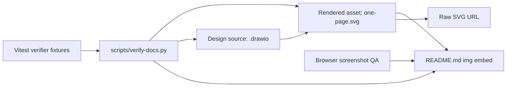

# GitHub README SVG Rendering Hardening Spec

**Date:** 2026-05-06
**Status:** Implemented locally - multi-agent spec review incorporated; GitHub-hosted verification pending push
**Scope:** `README.md` architecture image, `docs/design/kanban-task-engine-one-page.svg`, `docs/design/kanban-task-engine-one-page.drawio`, `docs/design/README.md`, `scripts/verify-docs.py`
**Primary Issue:** GitHub README renders the architecture SVG as a visually broken diagram instead of a readable overview.
**Implementation Note:** 2026-05-06 implementation uses a compact README SVG plus a self-contained one-page SVG, adds fixture-based docs verifier tests, splits the Python verifier into small `scripts/verify_docs/*` modules, and passes local build/test/docs/eval gates.

---

## 1. Executive Summary

`kanban-task-engine`의 README 아키텍처 이미지는 파일 링크가 깨진 것이 아니라, SVG asset이 GitHub README embed 환경에서 self-contained rendering contract를 만족하지 못해서 깨져 보인다.

이번 변경의 목표는 `docs/design/kanban-task-engine-one-page.svg`가 GitHub README, raw SVG, 로컬 브라우저, dark/light GitHub theme에서 모두 읽히도록 만들고, 같은 결함이 다시 들어오면 `scripts/verify-docs.py`가 실패하게 만드는 것이다.

완료 조건은 "파일이 존재한다"가 아니라 "GitHub README에서 사람이 실제로 읽을 수 있다"이다.

---

## 2. Context7 Evidence

Context7에서 조회한 최신 문서 근거:

**Lookup date:** 2026-05-06
**Queries used:**
- `/github/docs`: "How does GitHub render images in Markdown README files, especially SVG files referenced with img src or raw URLs? What constraints apply to styling, HTML sanitization, relative links, and raw.githubusercontent content?"
- `/mdn/content`: "For SVG embedded through an HTML img element, how are internal CSS style elements, presentation attributes like font-size, and external CSS applied?"

| Source | Evidence | Spec 적용 |
|---|---|---|
| GitHub Docs `/github/docs` | README Markdown은 repository-relative image link와 HTML `` embed를 지원한다. GitHub Docs는 dark/light mode용 `<picture>` 패턴도 안내한다. | README image 경로는 상대 경로를 유지할 수 있다. 문제 해결은 link 변경보다 asset contract와 theme-safe rendering에 집중한다. |
| MDN Web Docs `/mdn/content` | SVG `class` attribute는 SVG 내부 `<style>` 또는 presentation attribute로 스타일을 정의해 사용한다. SVG `<text>`는 `font-size`, `font-style`, `fill` 같은 presentation attribute로 직접 제어할 수 있다. | SVG는 외부 CSS에 기대지 않고 내부 `<style>` 또는 inline attributes만으로 텍스트 크기, 굵기, 색상을 결정해야 한다. |

---

## 3. Root Cause

### 3.1 Direct Cause

현재 `docs/design/kanban-task-engine-one-page.svg`는 `class="ttl"`, `class="zone"`, `class="bh"`, `class="bs"`, `class="al"`, `class="ann"`, `class="ptl"`, `class="stxt"`, `class="nt"`를 사용하지만 SVG 내부에 해당 class를 정의하는 `<style>`이 없다.

GitHub README는 SVG를 ``로 로드하므로 README 바깥 CSS가 SVG 내부 `<text>`에 적용되지 않는다. 정의되지 않은 class는 브라우저 기본 SVG 텍스트 스타일로 렌더링되고, 원래 의도한 font-size, weight, spacing이 사라져 텍스트가 겹치거나 너무 작아진다.

### 3.2 Contributing Causes

| Cause | Detail | Impact |
|---|---|---|
| Transparent background | SVG 전체 배경 rect가 없다. | GitHub dark theme에서 어두운 텍스트가 배경과 섞인다. |
| Oversized viewBox density | `viewBox="0 0 1600 900"` 안에 작은 `font-size=10` 텍스트가 많다. README column 폭으로 축소되면 실제 표시 크기가 6px 안팎이 된다. | 링크는 정상이어도 README 화면에서 읽을 수 없다. |
| False-positive verifier | `check_font_sizes()`가 class-based text의 resolved font-size를 계산하지 않는다. | 검증은 PASS인데 실제 README는 깨지는 상태가 된다. |
| No GitHub README render gate | `scripts/verify-docs.py`는 SVG 구조와 label presence만 본다. | "파일 내용"과 "README 표시 품질"의 차이를 잡지 못한다. |
| Source/render drift risk | `.drawio`, `.svg`, `.html`, README 설명이 별도 유지된다. | 한 asset만 수정되어 문서 truth가 어긋날 수 있다. |

---

## 4. Goals

1. README의 아키텍처 이미지가 GitHub desktop width에서 깨지지 않고 읽힌다.
2. `docs/design/kanban-task-engine-one-page.svg` raw URL을 열어도 배경, 텍스트, stroke, legend가 의도대로 보인다.
3. SVG가 self-contained asset contract를 가진다.
4. `scripts/verify-docs.py`가 이번 root cause를 재현 가능한 실패로 잡는다.
5. `docs/design/README.md`가 GitHub README용 SVG 작성 규칙과 검증 절차를 명시한다.
6. 새 검증은 Python stdlib 중심으로 유지해 dependency debt를 최소화한다.
7. 구현은 TDD로 진행한다. verifier 실패 테스트를 먼저 만들고, asset/script를 고쳐 green으로 만든다.

---

## 5. Non-Goals

- Runtime engine, schema, adapter, CLI behavior 변경.
- GitHub Pages 사이트 구축.
- 외부 이미지 CDN이나 capsule-render 같은 네트워크 의존 추가.
- `README.md` 전체 리라이트. 단, 기존 one-page SVG가 README 900px 가독성 기준을 만족하지 못하면 README embed asset을 compact overview로 교체하는 것은 목표 범위 안이다.
- draw.io Desktop 또는 Electron 기반 CLI를 CI 필수 의존성으로 추가.
- global Codex skill 생성. `skill-creator` 관점에서 이번 문제는 repo-local verifier와 docs rule로 충분히 재사용 가능하며, 전역 skill로 올릴 만큼 범용 절차가 아직 안정화되지 않았다.

---

## 6. Architecture Decision Record

# ADR-2026-05-06: GitHub README용 SVG Contract와 Repo-Local Verification

**Status:** Proposed
**Date:** 2026-05-06
**Deciders:** Repository owner, Codex implementation agent

## Context

GitHub README는 repository-relative SVG embed를 지원하지만, SVG 내부 스타일은 self-contained여야 한다. 현재 asset은 수동 fallback SVG이며, style class 정의 누락과 고밀도 viewBox 때문에 GitHub README에서 사람이 읽을 수 없는 상태가 되었다.

## Decision

`docs/design/kanban-task-engine-one-page.svg`를 self-contained README-safe SVG로 고치고, `scripts/verify-docs.py`에 SVG rendering contract 검증을 추가한다. 검증은 Python stdlib 기반 static checks를 기본 gate로 삼고, Browser Use 기반 screenshot QA와 CI docs gate를 release checklist에 포함한다.

`docs/design/kanban-task-engine-one-page.drawio`는 semantic/editing source이고, `.svg`는 GitHub README production render이다. draw.io export가 README-safe style layer를 보존하지 못할 수 있으므로, SVG production render는 export 후 hardening step을 거친 수동 maintained render로 취급한다. `.drawio`와 `.svg`는 critical labels, runtime-truth labels, layout intent가 drift되지 않아야 하며, verifier가 drift를 잡아야 한다.

## Options Considered

### Option A: 현재 SVG에 누락된 `<style>`만 복구

| Dimension | Assessment |
|---|---|
| Complexity | Low |
| Cost | Low |
| Maintainability | Medium |
| Regression safety | Low |

**Pros:** 가장 작고 빠른 수정.

**Cons:** 투명 배경, README 축소 가독성, verifier false-positive 문제를 남긴다.

### Option B: README embed를 PNG로 교체

| Dimension | Assessment |
|---|---|
| Complexity | Medium |
| Cost | Medium |
| Maintainability | Low |
| Regression safety | Medium |

**Pros:** GitHub 렌더링이 안정적이다.

**Cons:** raster export 도구가 필요하고, source/render drift가 커진다. SVG contract 문제를 숨길 뿐 고치지 않는다.

### Option C: Self-contained SVG + verifier hardening

| Dimension | Assessment |
|---|---|
| Complexity | Medium |
| Cost | Low |
| Maintainability | High |
| Regression safety | High |

**Pros:** 이번 root cause를 직접 닫고, 같은 결함이 재발하면 CI/로컬 검증에서 잡힌다. 새 runtime dependency가 필요 없다.

**Cons:** 실제 pixel rendering은 static checks만으로 완벽히 보장할 수 없어 screenshot QA를 병행해야 한다.

### Option D: README용 compact overview SVG를 새로 만들고 one-page SVG는 full-size link로만 둠

| Dimension | Assessment |
|---|---|
| Complexity | Medium |
| Cost | Medium |
| Maintainability | Medium |
| Regression safety | High |

**Pros:** README 첫 화면 가독성은 가장 좋다.

**Cons:** 사용자가 지적한 기존 `kanban-task-engine-one-page.svg` 자체의 결함을 숨길 위험이 있다. 따라서 Option D를 쓰더라도 one-page SVG 자체도 self-contained contract를 통과해야 한다.

## Trade-off Analysis

이번 이슈의 본질은 asset이 README embed contract를 충족하지 못하는 것이다. 따라서 Option C를 기본 결정으로 삼는다. 구현 중 README 축소 폭에서 one-page asset이 여전히 과밀하다고 확인되면 Option D를 같은 작업 안에서 적용한다. 이 경우 README embed는 compact overview SVG로 교체하고, one-page SVG는 full-size link로 유지한다. 어떤 경로를 택하든 one-page SVG 자체는 self-contained raw SVG로 정상 렌더링되어야 한다.

## Consequences

- SVG 작성자는 class를 쓰더라도 내부 `<style>` 정의를 함께 유지해야 한다.
- verifier는 "font-size 문자열 존재"가 아니라 "모든 `<text>`의 resolved font-size 추정"을 검사해야 한다.
- README image가 dark theme에 의존하지 않도록 SVG 내부 배경이 필수가 된다.
- visual docs 변경은 `python3 scripts/verify-docs.py`와 screenshot QA를 함께 통과해야 한다.
- visual docs 변경은 CI docs gate도 통과해야 한다.

## Action Items

1. [ ] `scripts/verify-docs.py`에 SVG contract checks 추가.
2. [ ] current broken SVG fixture가 실패하는 테스트를 먼저 작성.
3. [ ] `docs/design/kanban-task-engine-one-page.svg`를 self-contained asset으로 수정.
4. [ ] `docs/design/README.md`에 README SVG 작성 규칙 추가.
5. [ ] Browser Use 또는 local browser screenshot으로 README 영역을 확인.

---

## 7. System Design

### 7.1 Components

| Component | Responsibility |
|---|---|
| `README.md` | GitHub 첫 화면에서 architecture image를 embed하고 full-size/source docs로 연결한다. |
| `docs/design/kanban-task-engine-one-page.svg` | README-safe rendered asset. 외부 CSS 없이 단독 렌더링된다. |
| `docs/design/kanban-task-engine-one-page.drawio` | 편집용 source. 주요 label과 구조가 SVG와 drift되지 않아야 한다. |
| `docs/design/kanban-task-engine-one-page.html` | 로컬 interactive/readability fallback. 이번 변경에서는 source of truth가 아니다. |
| `docs/design/README.md` | visual asset authoring guide와 validation contract를 문서화한다. |
| `scripts/verify-docs.py` | repo-local static verifier. GitHub README에서 깨질 가능성이 높은 SVG 결함을 fail-fast로 잡는다. `--root <path>`로 fixture root를 주입할 수 있어야 한다. |
| `scripts/verify-docs.test.ts` | verifier의 regression tests. temp fixture root로 Python verifier를 실행해 broken fixture가 RED가 되는지 증명한다. |
| `.github/workflows/ci.yml` | PR/push에서 docs verification을 실행한다. |

### 7.2 Data Flow



### 7.3 Source/Render Ownership Contract

1. `.drawio` is the semantic editing source for zones, labels, and layout intent.
2. `.svg` is the production render for README/raw display.
3. `.svg` may include manual post-export hardening that `.drawio` cannot represent directly, such as internal style normalization or readability-only text simplification.
4. Any change to critical architecture meaning must be reflected in both `.drawio` and `.svg`.
5. `docs/design/README.md` must document that raw draw.io export is not enough; exported SVG must pass `python3 scripts/verify-docs.py`.
6. If a compact README overview asset is introduced, it must have a corresponding `.drawio` source or an explicit note that it is manually authored SVG, and both paths must be indexed in `docs/design/README.md`.

### 7.4 SVG Self-Contained Contract

`docs/design/kanban-task-engine-one-page.svg` must satisfy every rule below:

1. Root `<svg>` has `xmlns` and `viewBox`.
2. A background `<rect>` covers the full viewBox.
3. No `<script>`.
4. No `<foreignObject>`.
5. No external `href`, `xlink:href`, remote image, remote font, or external stylesheet.
6. Every class used by SVG elements is defined in an internal `<style>` block, or the class is removed.
7. Every `<text>` has a resolved font-size from direct `font-size` attribute or internal class style.
8. Minimum resolved source font-size is high enough for the asset's target render width.
9. Estimated README display font-size applies to the actual SVG embedded by the README architecture section. The one-page SVG is a full-size/raw target and must pass self-contained, background, forbidden-reference, accessibility, and runtime-truth gates, but not the 900px README effective-font gate when README embeds the compact overview.
10. Estimated README display font-size uses:

   ```text
   effective_px = resolved_font_size * rendered_width / viewBox_width
   ```

   At `rendered_width=900`, body text must be `>= 8px`, title/zone labels must be `>= 12px`, and footer/legend text must be either `>= 8px` or not used as required information.
11. Critical labels do not rely on emoji alone.
12. Fill colors for text are selected against the SVG-owned background, not GitHub page background.
13. Footer/legend text is readable or omitted from README display.
14. Text/background contrast must meet WCAG AA for SVG-owned backgrounds: normal text 4.5:1, large title/zone text 3:1.
15. Critical text must not visibly overlap neighboring labels, strokes, or boxes in screenshot QA.
16. SVG must reject `@import`, CSS `url(...)`, remote `@font-face`, `<image href=...>`, `href`, and `xlink:href` external references.
17. SVG must include `<title>` and `<desc>`.
18. SVG must reject `<script>` and `<foreignObject>`.

### 7.5 README Rendering Contract

README must keep a centered architecture image with alt text and a full-size link. The image can remain:

```html
<a href="docs/design/kanban-task-engine-one-page.svg">
  
</a>
```

If implementation proves the one-page density cannot be made readable at GitHub README width without losing key information, create a compact `docs/design/kanban-task-engine-architecture-overview.svg` for README embed and keep `kanban-task-engine-one-page.svg` as the full-size target. This fallback is mandatory, not optional, when the one-page SVG fails the 900px effective-font or screenshot-readability gate. Both assets must pass the self-contained contract.

The README image `alt` must describe the diagram purpose, not only click guidance. Click/full-size guidance belongs in adjacent prose.

### 7.6 Architecture Truth Contract

The diagram must be readable and true.

1. Any `packages/<name>` label must correspond to an existing directory under `packages/`, unless explicitly described as an executor/source file rather than a package.
2. Codex execution must be labeled as `codex-runner` or `packages/core/src/executor/codex-runner.ts`; it must not imply a non-existent `packages/adapter-codex`.
3. Status labels and transition counts must match `packages/schema/src/status.ts`.
4. Runtime-policy and adapter-policy claims must be backed by existing docs or source paths.
5. README text version and SVG must agree on Vault, Engine, External, lifecycle, Work Mode, validate-only, and Codex executor semantics.

---

## 8. Frontend Design Direction

Use the `frontend-design` plugin principles, but keep this as a documentation asset rather than a marketing hero.

Design stance:

- Quiet, operational, architecture-focused.
- Avoid decorative gradients that obscure text.
- Use a full SVG-owned light background so GitHub theme cannot break contrast.
- Prefer dense but readable system-map design over oversized hero treatment.
- Use consistent zones: Vault, Engine, External, Work Mode.
- Keep cards/boxes flat, with small radius and strong labels.
- Do not depend on animation, web fonts, external assets, or JavaScript.

Readable README target:

| View | Width assumption | Requirement |
|---|---:|---|
| GitHub desktop README | 900px | All major labels readable without zoom. |
| Full-size raw SVG | native viewBox | All panel text readable. |
| Mobile GitHub README | 360px | Diagram may be visually compressed, but title, zones, and full-size instruction remain visible. |

Screenshot evidence:

| Evidence | Required path |
|---|---|
| README section desktop light | `/private/tmp/kanban-svg-readme-desktop-light.png` or PR artifact |
| README section desktop dark | `/private/tmp/kanban-svg-readme-desktop-dark.png` or PR artifact |
| README section mobile | `/private/tmp/kanban-svg-readme-mobile.png` or PR artifact |
| Raw SVG full-size | `/private/tmp/kanban-svg-raw.png` or PR artifact |

---

## 9. Testing Strategy

### 9.1 Test Pyramid

| Layer | Tool | Purpose | Required |
|---|---|---|---|
| Unit/static tests | Vitest + temp fixture roots | Verify `scripts/verify-docs.py --root <fixture>` catches missing class styles, missing background, too-small effective font, external refs, source/render drift. | Yes |
| Script integration | `python3 scripts/verify-docs.py` | Validate real repo docs and assets. | Yes |
| Build/test regression | `pnpm -r build`, `pnpm -r test` | Ensure no repo-wide breakage. | Yes if scripts or package metadata change |
| Visual QA | Browser Use screenshot or local browser | Confirm README section is visibly readable. | Yes before completion |
| Remote verification | GitHub README after push | Confirm public rendered state. | Required before calling GitHub-hosted issue fully closed |
| CI gate | GitHub Actions | Run docs verify on PR/push. | Yes |

### 9.2 Required Test Cases

| Test | Fixture | Expected |
|---|---|---|
| Missing style class fails | SVG uses `class="bs"` with no `.bs` definition | `verify-docs.py` returns non-zero and names undefined class. |
| Missing background fails | SVG has no full-viewBox background rect | non-zero with background error. |
| Too-small README effective font fails | `viewBox` width 1600 and body font 10 | non-zero with effective font-size error. |
| Internal style passes | SVG defines `.bs { font-size: 16px; }` and uses `class="bs"` | pass. |
| Inline font passes | SVG text uses `font-size="16"` without class | pass. |
| External href fails | SVG references `https://...` in href | non-zero. |
| External CSS url fails | SVG uses `@import`, `url(https://...)`, or remote `@font-face` | non-zero. |
| Runtime false label fails | SVG labels non-existent `packages/adapter-codex` | non-zero unless remapped to existing codex runner source. |
| Drawio/SVG parity fails | SVG has critical label missing from `.drawio` or vice versa | non-zero. |
| Real asset passes | Current repository `docs/design/kanban-task-engine-one-page.svg` after fix | pass. |

### 9.3 Coverage Targets

- `scripts/verify-docs.py` behavior-level fixture coverage for all newly added checks.
- All previously existing verification checks remain covered by real repo integration run.
- No snapshot-only tests for SVG text. Tests must assert behavior and failure messages.
- Tests must not overwrite real repository docs. They must create temporary fixture roots and invoke `python3 scripts/verify-docs.py --root <tmpdir>`.

### 9.4 Verifier Implementation Rules

Use Python stdlib.

- Use `xml.etree.ElementTree` for SVG parsing.
- Use small, explicit CSS parsing only for selectors needed by this repo: `.class { key: value; }`, `text { key: value; }`.
- Keep regex only for bounded CSS declarations, not XML tree structure.
- Treat XML namespace explicitly.
- Emit failure messages that name the offending class, text, or element.
- Provide `--root <path>` CLI argument while preserving default repo-root behavior.

---

## 10. Documentation Updates

Use the `documentation` skill principles: start with reader need, show commands, link instead of duplicating.

Required updates:

1. `docs/design/README.md`
   - Add "GitHub README SVG contract" section.
   - Document required background, self-contained class styles, font-size/readability thresholds, no external assets.
   - Document exact verification command.
2. `docs/design/HANDOFF-2026-05-03.md` or a new handoff note
   - Add this follow-up as the correction for the previous false-positive verification.
3. `README.md`
   - Keep full-size click guidance.
   - If README image path changes to compact overview, explain full one-page link without adding noisy tutorial text.
4. `docs/superpowers/plans/2026-05-06-github-readme-svg-rendering-hardening-plan.md`
   - Include plugin usage per step, TDD gates, rollback steps, and review gates.

---

## 11. Deploy Checklist

This is a documentation/asset release, but the public GitHub README is the production surface.

### Pre-Deploy

- [ ] `pnpm exec vitest run scripts/verify-docs.test.ts` passes.
- [ ] `python3 scripts/verify-docs.py` passes.
- [ ] CI includes a docs verification step.
- [ ] `pnpm -r build` passes if TypeScript/package metadata changes.
- [ ] `pnpm -r test` passes if package scripts or shared repo config changes.
- [ ] README image path is repository-relative and case-correct.
- [ ] SVG raw URL opens locally and shows background/text.
- [ ] Browser Use or local browser screenshot confirms README section readability at the required evidence paths.
- [ ] No generated private/runtime files are staged.

### Deploy

- [ ] Commit with required `Co-Authored-By: Codex <model> <noreply@openai.com>` trailer.
- [ ] Push branch or main according to user instruction.
- [ ] Open GitHub README after push.
- [ ] Open raw SVG after push.

### Post-Deploy

- [ ] Confirm GitHub README architecture image is readable in desktop GitHub UI.
- [ ] Confirm dark/light theme does not hide labels.
- [ ] Confirm full-size SVG link works.
- [ ] Record verification evidence in final response or PR body.
- [ ] Do not state "GitHub-hosted issue closed" until hosted README and raw SVG are verified after push. Before push, state only "repo-code ready" or "local verification complete".

### Rollback Triggers

- README image fails to load.
- README image loads but text remains unreadable at desktop GitHub width.
- Raw SVG shows transparent/dark unreadable background.
- `scripts/verify-docs.py` passes despite a reproduced broken fixture.
- New dependency or script breaks `pnpm -r test` unexpectedly.

---

## 12. Tech Debt Analysis

| Debt | Type | Impact | Risk | Effort | Priority | Remediation |
|---|---|---:|---:|---:|---:|---|
| SVG verifier misses class-defined font styles | Test debt | 5 | 5 | 2 | 40 | Add fixture-backed checks for undefined classes and resolved font-size. |
| README rendering has no visual gate | Test debt | 4 | 5 | 3 | 27 | Add documented screenshot QA and required Browser Use or equivalent local-browser evidence step. |
| Manual SVG and draw.io can drift | Documentation debt | 4 | 4 | 3 | 24 | Verify shared critical labels; document source/render update protocol. |
| High-density one-page asset used as README preview | UX/documentation debt | 4 | 3 | 3 | 21 | Make one-page readable or introduce compact README overview with full-size link. |
| No machine-readable SVG contract docs | Documentation debt | 3 | 4 | 2 | 28 | Add GitHub README SVG contract to `docs/design/README.md`. |
| Future agents may rely on style classes without definitions | Code/documentation debt | 3 | 4 | 1 | 35 | Verifier fails undefined class use. |

Priority formula: `(Impact + Risk) x (6 - Effort)`.

---

## 13. Implementation Constraints

- Use TDD before modifying production asset/script behavior.
- Keep changes scoped to docs/design, README, verify-docs, and tests.
- Prefer Python stdlib for verifier hardening.
- Do not introduce Electron/draw.io CLI as mandatory dependency.
- Do not make destructive git operations.
- Do not remove the full-size SVG link.
- Preserve Korean body text in repo docs while keeping technical identifiers in English.
- Ensure implementation plan names exact files and commands.

---

## 14. Acceptance Criteria

### P0 - Must Pass

- [ ] `scripts/verify-docs.py --root <fixture>` fails on a fixture with undefined SVG text class.
- [ ] `scripts/verify-docs.py --root <fixture>` fails on a fixture with no full-viewBox background.
- [ ] `scripts/verify-docs.py --root <fixture>` fails on a fixture where estimated README display font-size is below 8px.
- [ ] `scripts/verify-docs.py --root <fixture>` fails on external references including `href`, `xlink:href`, `<image>`, `@import`, `url(...)`, and remote font declarations.
- [ ] `scripts/verify-docs.py --root <fixture>` fails on a false package label such as `packages/adapter-codex`.
- [ ] `scripts/verify-docs.py --root <fixture>` can be tested from Vitest without modifying real repo files.
- [ ] Real `docs/design/kanban-task-engine-one-page.svg` passes the new SVG contract checks.
- [ ] `python3 scripts/verify-docs.py` exits 0 on fixed repo state.
- [ ] README architecture image remains linked and accessible.
- [ ] Browser/screenshot QA confirms no broken unreadable text in the README architecture section at 900px desktop light, 900px desktop dark, 360px mobile, and raw SVG full-size views.
- [ ] If one-page SVG cannot meet the README 900px readability gate, README embed is changed to compact overview SVG and one-page SVG remains linked full-size.
- [ ] CI runs the docs verification gate.
- [ ] SVG/README do not reference non-existent `packages/adapter-codex`; Codex execution is represented as `codex-runner` backed by `packages/core/src/executor/codex-runner.ts`.

### P1 - Should Pass

- [ ] `docs/design/README.md` documents the SVG contract.
- [ ] `docs/design/kanban-task-engine-one-page.drawio` retains critical labels, layout intent, source/render ownership, and runtime-truth evidence aligned with the SVG.
- [ ] No external asset references are introduced in the SVG.
- [ ] `pnpm -r test` remains green if package/test config changes.
- [ ] `package.json` exposes a `docs:verify` or equivalent script, or CI invokes `python3 scripts/verify-docs.py` directly with rationale documented.
- [ ] If CI workflow shape changes, `scripts/check-hardening.ts` and `scripts/eval-superpowers.ts` CI-shape guards are updated in the same plan.

### P2 - Follow-Up Allowed

- [ ] Add a future skill only after this repo-local pattern repeats in another repository.

---

## 15. Review Plan

Spec review must use at least three independent agents:

| Reviewer | Focus | Required Questions |
|---|---|---|
| A - Architecture/runtime truth | Does the spec preserve existing visual-doc source/render boundaries, reject false runtime labels, and avoid runtime scope creep? |
| B - Frontend/accessibility | Will the SVG actually render readably in GitHub README dark/light contexts and is compact fallback mandatory when needed? |
| C - Testing/tech debt | Do the tests catch this exact regression, support fixture root injection, run in CI, and minimize dependency/maintenance debt? |

All P0/P1 findings must be incorporated into this spec before implementation plan authoring.

---

## 16. Review Results

### 16.1 Multi-Agent Spec Review - 2026-05-06

| Reviewer | Focus | Blocking Findings | Spec Patch |
|---|---|---|---|
| A | Architecture/runtime truth | Source/render boundary not closed; runtime truth gate missing; CI gate missing. | Added §7.3 source/render contract, §7.6 architecture truth contract, P0/P1 CI and false-label acceptance. |
| B | Frontend/accessibility | Compact overview fallback was optional; hosted/light/dark GitHub evidence missing. | Made compact fallback mandatory when one-page fails 900px readability; added exact screenshot evidence and alt/text-version requirements. |
| C | Testing/tech debt | Fixture strategy incompatible with hardcoded repo root; CI not connected. | Added `--root <path>` verifier contract, Vitest temp fixture strategy, Python stdlib XML parser guidance, CI docs gate. |

Remaining non-blocking follow-ups:

- A future global skill is not created in this slice.
- Compact overview source format is decided only if the implementation proves one-page cannot satisfy README readability.
