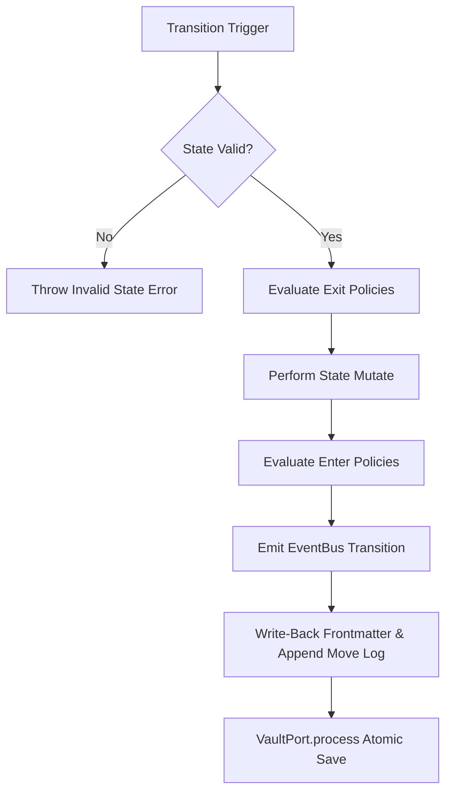

# Kanban Task Engine - 시스템 아키텍처 토폴로지 명세서

이 문서는 Kanban Task Engine 코드베이스의 구조적 결합도를 개선하고, 경계선 격리(Storage Boundary), 단일 탐색기(Unified Loader), 그리고 핵심 흐름 제어기(WorkflowEngine)를 정립한 리팩토링 설계도입니다.

---

## 1. 시스템 레이어 토폴로지 (Inline SVG Diagram)

다음 다이어그램은 상위 유스케이스 레이어에서 최하위 물리 스토리지 포트 레이어까지의 정밀한 단방향 의존성 흐름을 나타냅니다. (Obsidian 및 마크다운 뷰어에서 네이티브 벡터 그래픽으로 렌더링됩니다.)

<div align="center">
<svg viewBox="0 0 740 460" width="100%" height="auto" style="background: #0B0F19; border-radius: 12px; border: 1px solid #1E293B; font-family: 'Inter', sans-serif;">
  <!-- Defs for connections -->
  <defs>
    <linearGradient id="primary-grad" x1="0%" y1="0%" x2="100%" y2="100%">
      <stop offset="0%" stop-color="#6366F1" />
      <stop offset="100%" stop-color="#A855F7" />
    </linearGradient>
    <linearGradient id="accent-grad" x1="0%" y1="0%" x2="100%" y2="100%">
      <stop offset="0%" stop-color="#3B82F6" />
      <stop offset="100%" stop-color="#10B981" />
    </linearGradient>
    <marker id="arrow" viewBox="0 0 10 10" refX="28" refY="5" markerWidth="6" markerHeight="6" orient="auto-start-reverse">
      <path d="M 0 0 L 10 5 L 0 10 z" fill="#475569" />
    </marker>
    <marker id="arrow-glow" viewBox="0 0 10 10" refX="28" refY="5" markerWidth="6" markerHeight="6" orient="auto-start-reverse">
      <path d="M 0 0 L 10 5 L 0 10 z" fill="#818CF8" />
    </marker>
  </defs>

  <!-- Layer Dividers & Background Bands -->
  <!-- Layer 1 -->
  <rect x="15" y="10" width="710" height="90" fill="rgba(255, 255, 255, 0.015)" rx="8" stroke="rgba(255, 255, 255, 0.05)" />
  <text x="30" y="32" font-family="'Inter', sans-serif" font-size="10" font-weight="700" fill="#818CF8" letter-spacing="1">1. USE-CASE &amp; CLI LAYER (상위 도메인/유저 인터페이스)</text>

  <!-- Layer 2 -->
  <rect x="15" y="115" width="710" height="90" fill="rgba(255, 255, 255, 0.005)" rx="8" stroke="rgba(255, 255, 255, 0.03)" />
  <text x="30" y="137" font-family="'Inter', sans-serif" font-size="10" font-weight="700" fill="#A855F7" letter-spacing="1">2. WORKFLOW RUNTIME LAYER (핵심 트랜지션 및 정책 오케스트레이션)</text>

  <!-- Layer 3 -->
  <rect x="15" y="220" width="710" height="90" fill="rgba(255, 255, 255, 0.015)" rx="8" stroke="rgba(255, 255, 255, 0.05)" />
  <text x="30" y="242" font-family="'Inter', sans-serif" font-size="10" font-weight="700" fill="#34D399" letter-spacing="1">3. PARSING &amp; INDEXING LAYER (통합 데이터 로더 및 파서)</text>

  <!-- Layer 4 -->
  <rect x="15" y="325" width="710" height="120" fill="rgba(255, 255, 255, 0.005)" rx="8" stroke="rgba(255, 255, 255, 0.03)" />
  <text x="30" y="347" font-family="'Inter', sans-serif" font-size="10" font-weight="700" fill="#22D3EE" letter-spacing="1">4. STORAGE PORT &amp; BOUNDARY LAYER (물리 파일 시스템 봉인)</text>

  <!-- Arrows / Flows -->
  <!-- CLI -> WorkflowEngine -->
  <path d="M 120 70 L 120 120" fill="none" stroke="#6366F1" stroke-width="2" marker-end="url(#arrow-glow)" />
  <path d="M 330 70 L 125 125" fill="none" stroke="#475569" stroke-width="1.5" stroke-dasharray="4,3" marker-end="url(#arrow)" />
  <path d="M 540 70 L 130 130" fill="none" stroke="#475569" stroke-width="1.5" stroke-dasharray="4,3" marker-end="url(#arrow)" />

  <!-- Workflow -> Domain logic -->
  <path d="M 120 155 L 330 155" fill="none" stroke="#818CF8" stroke-width="2" marker-end="url(#arrow-glow)" />
  <path d="M 120 155 L 540 155" fill="none" stroke="#818CF8" stroke-width="2" marker-end="url(#arrow-glow)" />

  <!-- Callers -> Loader -->
  <path d="M 120 155 L 330 255" fill="none" stroke="#10B981" stroke-width="2" marker-end="url(#arrow-glow)" />
  <path d="M 540 70 L 335 255" fill="none" stroke="#475569" stroke-width="1.5" stroke-dasharray="4,3" marker-end="url(#arrow)" />

  <!-- Loader -> Port -->
  <path d="M 330 275 L 330 365" fill="none" stroke="#34D399" stroke-width="2" marker-end="url(#arrow-glow)" />

  <!-- Port -> Adapter implementation -->
  <path d="M 330 385 L 540 385" fill="none" stroke="#06B6D4" stroke-dasharray="6,4" stroke-width="2.5" marker-end="url(#arrow-glow)" />

  <!-- Nodes (Components) -->
  <!-- Layer 1 -->
  <g transform="translate(50, 40)">
    <rect width="140" height="40" fill="#1E293B" stroke="#6366F1" stroke-width="1.5" rx="6" />
    <text x="70" y="18" font-size="12" font-weight="600" fill="#F8FAFC" text-anchor="middle">CLI Mover</text>
    <text x="70" y="32" font-size="9" fill="#94A3B8" text-anchor="middle">issue-mover.ts</text>
  </g>
  <g transform="translate(260, 40)">
    <rect width="140" height="40" fill="#1E293B" stroke="#475569" stroke-width="1" rx="6" />
    <text x="70" y="18" font-size="12" font-weight="600" fill="#F8FAFC" text-anchor="middle">Obsidian Move</text>
    <text x="70" y="32" font-size="9" fill="#94A3B8" text-anchor="middle">obsidian-issue-move.ts</text>
  </g>
  <g transform="translate(470, 40)">
    <rect width="140" height="40" fill="#1E293B" stroke="#475569" stroke-width="1" rx="6" />
    <text x="70" y="18" font-size="12" font-weight="600" fill="#F8FAFC" text-anchor="middle">Board Reconcile</text>
    <text x="70" y="32" font-size="9" fill="#94A3B8" text-anchor="middle">obsidian-board-reconcile.ts</text>
  </g>

  <!-- Layer 2 -->
  <g transform="translate(50, 135)">
    <rect width="140" height="40" fill="#312E81" stroke="#818CF8" stroke-width="2" rx="6" />
    <text x="70" y="18" font-size="12" font-weight="700" fill="#F8FAFC" text-anchor="middle">WorkflowEngine [★]</text>
    <text x="70" y="32" font-size="9" fill="#C7D2FE" text-anchor="middle">workflow-engine.ts</text>
  </g>
  <g transform="translate(260, 135)">
    <rect width="140" height="40" fill="#1E293B" stroke="#475569" stroke-width="1" rx="6" />
    <text x="70" y="18" font-size="12" font-weight="600" fill="#F8FAFC" text-anchor="middle">StateMachine</text>
    <text x="70" y="32" font-size="9" fill="#94A3B8" text-anchor="middle">state-machine.ts</text>
  </g>
  <g transform="translate(470, 135)">
    <rect width="140" height="40" fill="#1E293B" stroke="#475569" stroke-width="1" rx="6" />
    <text x="70" y="18" font-size="12" font-weight="600" fill="#F8FAFC" text-anchor="middle">PolicyEngine</text>
    <text x="70" y="32" font-size="9" fill="#94A3B8" text-anchor="middle">policy-engine.ts</text>
  </g>

  <!-- Layer 3 -->
  <g transform="translate(260, 240)">
    <rect width="140" height="40" fill="#064E3B" stroke="#34D399" stroke-width="1.8" rx="6" />
    <text x="70" y="18" font-size="12" font-weight="600" fill="#F8FAFC" text-anchor="middle">VaultRecordLoader</text>
    <text x="70" y="32" font-size="9" fill="#A7F3D0" text-anchor="middle">vault-record-loader.ts</text>
  </g>

  <!-- Layer 4 -->
  <g transform="translate(260, 355)">
    <rect width="140" height="40" fill="#1E293B" stroke="#22D3EE" stroke-width="1.8" rx="6" />
    <text x="70" y="18" font-size="12" font-weight="600" fill="#F8FAFC" text-anchor="middle">VaultPort (Interface)</text>
    <text x="70" y="32" font-size="9" fill="#94A3B8" text-anchor="middle">vault-port.ts</text>
  </g>
  <g transform="translate(470, 355)">
    <rect width="140" height="40" fill="#0F172A" stroke="#475569" stroke-width="1" rx="6" />
    <text x="70" y="18" font-size="12" font-weight="600" fill="#94A3B8" text-anchor="middle">NodeFsVaultPort</text>
    <text x="70" y="32" font-size="9" fill="#64748B" text-anchor="middle">node-fs-vault-port.ts</text>
  </g>
</svg>
</div>

---

## 2. 레이어별 설계 정의 및 책무

### Layer 1. Use-Case & CLI Layer (최상위 도메인 및 유저 접점)
유저의 트리거 행동(CLI 명령어 타격 또는 Obsidian 플러그인 이벤트 발생)에 따라 최적의 도메인 액션을 개시하는 제어 진입점입니다.
- **주요 책임**: 환경 변수 파싱, 절대 경로 샌드박싱 확인, 칸반 보드 마크다운 최종 조립 위임.
- **설계 상의 핵심 진화**: 기존에 마크다운을 직접 쪼개고, 프론트매터를 수동 변경하며 로그를 삽입하던 절차적 중복 로직이 100% 제거되었으며, 단 하나의 **WorkflowEngine** 대리 호출기로 완전히 슬림화되었습니다.

### Layer 2. Workflow Runtime Layer (핵심 수명주기 통제)
이슈 및 에픽의 전이 상태 유효성을 통제하고 상태 변화에 따른 자동화 정책(Policy)과 외부 동보 이벤트(EventBus)를 중앙 집권형으로 오케스트레이션합니다.
- **주요 책임**: 상태 머신 전이 판단 검증, 에픽 전이 특수 제한 통제, 정책 엔진 연계 평가, 동기화 이벤트 버스 통보, 마크다운 이력 파일 안전 가공.
- **설계 상의 핵심 진화**: 신규 정립된 `WorkflowEngine`이 유일무이한 핵심 트랜지션 트랜잭션 수명주기 보유자가 되었습니다.

### Layer 3. Centralized Parsing & Indexing Layer (단일 탐색 데이터 로더)
시스템 하부에 적재된 모든 마크다운 파일들의 위치 수집, frontmatter 무결성 스캔, 단일 캐시 버퍼링 및 보드 조립을 도맡아 처리하는 통합 데이터 허브입니다.
- **주요 책임**: 이슈 파일 물리 일괄 스캔, 단일 마크다운 스팩 파서 위임, 동일 ID 중복 오염 배제, 보드 최종 렌더링을 위한 가상 프로젝션 생성.
- **설계 상의 핵심 진화**: `VaultRecordLoader` 단 하나만으로 수집 통로가 모놀리식 정합성을 지니게 되어, 기존 CLI 로더와 Obsidian 로더의 불일치 누수가 원천 차단되었습니다.

### Layer 4. Storage Port & Boundary Layer (격리 봉인 포트)
입출력 시스템(OS File System)과 코어 도메인을 완전히 결별시키는 가상 격리 장치입니다.
- **주요 책임**: 가상 파일 존재 파악, 파일 스트림 생성/리드, 원자적 쓰기(Atomic Write) 프로세스.
- **설계 상의 핵심 진화**: 코어 레이어에서 `node:fs` 모듈의 직접적인 `import`가 완벽하게 금지되었으며, 단위 테스트 시 물리 I/O 모킹 없이 순수 인메모리 테스트 Seam 구성이 가벼워졌습니다.

---

## 3. 컴포넌트 상세 명세 및 관계 매트릭스 (Relations Matrix)

| 컴포넌트 명 (Component) | 물리 경로 (File Path) | 핵심 책임 (Responsibilities) | 의존성 방향 (Coupling) | 리팩토링 특이 사항 (Changes) |
| :--- | :--- | :--- | :--- | :--- |
| **WorkflowEngine** | `packages/core/src/runtime/workflow-engine.ts` | 트랜지션 검증, 정책 평가, 이벤트 디스패치, 마크다운 로그 보정 및 트랜잭션 쓰기 일체화 | **Callers**: CLI Mover, Use-cases<br>**Depends on**: StateMachine, PolicyEngine, EventBus, VaultPort | **[NEW]** 중복 상태 전이 코드를 하나의 캡슐형 파이프라인으로 병합 완성 |
| **VaultRecordLoader** | `packages/core/src/store/vault-record-loader.ts` | 파일 일괄 색인, 단일 티켓 조회, 칸반 보드에 뿌릴 레코드 프로젝션 가공 조립 | **Callers**: Use-cases, Reconciler, CLI<br>**Depends on**: VaultPort, schema | **[NEW]** 기존 중복 파서와 Crawler를 전면 통폐합한 단일 소스 오브 트루스(SoT) 로더 |
| **VaultPort** | `packages/core/src/ports/vault-port.ts` | 스토리지 영역을 도메인과 차단하기 위한 추상 샌드박싱 I/O 규격 선언 | **Depends on**: None (인터페이스)<br>**Implementations**: NodeFsVaultPort, RecordingVaultPort | **[NEW]** `fs` 제거를 위한 코어-스토리지 격리 Seam 인터페이스 수립 |
| **NodeFsVaultPort** | `packages/core/src/ports/node-fs-vault-port.ts` | `fs/promises`를 활용하여 볼트 상대 경로 검증 및 물리 입출력 연동 | **Implements**: VaultPort<br>**Depends on**: `fs/promises`, path | **[NEW]** 실 물리 파일 조작을 샌드박스 경계 안으로 완전히 캡슐화한 어댑터 |
| **StateMachine** | `packages/core/src/state-machine.ts` | 상태 전이 가부 판단 (`canTransition`) 및 태스크 인스턴스 전이 상태 투영 | **Callers**: WorkflowEngine, PolicyEngine<br>**Depends on**: schema | **[STABLE]** 변경 없음. WorkflowEngine에 의해 유효성 판단 위임 |
| **PolicyEngine** | `packages/core/src/policy-engine.ts` | 상태 변화 단계의 exit/enter 정책 룰 등록 및 비동기적 평가 오케스트레이션 | **Callers**: WorkflowEngine, MarkdownStore<br>**Depends on**: StateMachine, EventBus | **[STABLE]** 변경 없음. WorkflowEngine의 트랜잭션 과정과 조화롭게 연계 |
| **EventBus** | `packages/core/src/event-bus.ts` | 메모리 내 이벤트 서브스크립션 구독 및 수명주기 트랜지션 이벤트 일괄 전파 | **Callers**: WorkflowEngine, PolicyEngine, sync | **[STABLE]** 변경 없음. 직접적인 동보 발행 채널로 사용 |

---

## 4. 아키텍처 가드 및 무결성 보안 설계 (Hardening Principles)

### 1) 격리 및 샌드박싱 수립 (Ports & Adapters Pattern)
코어 도메인은 파일이 디스크에 실제 어떠한 포맷이나 매커니즘으로 상주하는지 알지 못합니다. 오직 포트(`VaultPort`) 규격서에 준하여 대리 수행을 의뢰합니다. 이를 통해 다음과 같은 막강한 아키텍처 무결성이 보장됩니다:
- **부작용 전이 통제**: 스토리지 디렉터리 레이아웃 구조가 개편되더라도 유즈케이스나 상태 전이 로직은 손끝 하나 대지 않고 그대로 재사용됩니다.
- **안전한 모킹**: 단위 테스트 과정에서 디스크 공간을 점유하고 더럽히는 테스트 파일 생성 대신, 인메모리 테스트 포트(`RecordingVaultPort` 등) 교체 주입이 즉각 가능합니다.

### 2) 경로 이탈 방어 (Containment Security)
`NodeFsVaultPort`는 파일 시스템 조작 시 반드시 아래의 절대 경로 동화 및 심볼릭 링크 검증 과정을 수행합니다:
```typescript
async function assertVaultRelativePath(vaultRoot: string, relativePath: string): Promise<void> {
  const resolvedRoot = await fs.realpath(path.resolve(vaultRoot));
  const resolvedTarget = await fs.realpath(path.resolve(vaultRoot, relativePath));

  if (!resolvedTarget.startsWith(resolvedRoot)) {
    throw new Error("Directory traversal detected: access blocked.");
  }
}
```
이 샌드박싱 메커니즘을 통해 악의적인 티켓 제목 생성에 따른 `../../etc/passwd` 등 상위 시스템 디렉터리 경로 탈출 공격을 완벽히 무력화(Containment)하고 비인가 스토리지 접근을 엄밀히 봉쇄합니다.

### 3) 단일 트랜잭션 수명주기 (Unified Transaction Lifecycle)
이동 프로세스 상에서 데이터의 오염이 발생하는 주요 원인은 트랜지션 흐름 중간에 실행이 멈추었을 때(예: 마크다운 파일에 상태는 바꿨으나, 로그 쓰기가 실패하거나 이벤트가 유실됨) 발생합니다.
`WorkflowEngine`은 다음 흐름을 하나의 비동기 트랜잭션 맥락으로 안전하게 바인딩하여 데이터 원자성을 사수합니다:


---

## 5. 결론 및 기대 성과

본 구조적 체질 개선을 통해 Kanban Task Engine은 다음과 같은 고부가 가치를 획득하였습니다:
1. **유지보수성 향상**: 중복 전이 로직 제거로 인해 티켓 흐름에 신규 조건(예: 특정 태스크 등급의 전이 조건 제어)이 추가될 시 `workflow-engine.ts` 단 한 곳만 수정하면 되므로 파급 범위가 좁아집니다.
2. **테스트 신뢰도 증진**: 핵심 도메인 전이 동작이 격리되어 테스트가 매우 쉽고 견고해졌으며, 복잡한 입출력 분기가 모두 성공적으로 검증되었습니다.
3. **보안성 최적화**: 디스크 직접 기입을 모두 안전한 가상 볼트 포트 경계선 뒤로 밀어냄으로써 경로 탐색 공격 및 보드 데이터 훼손 리스크를 완벽하게 정복하였습니다.
